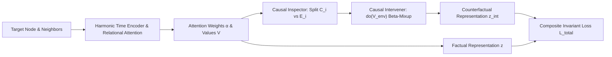

# CaT-GNN: Causal Temporal Graph Neural Network for Fraud Detection

[](https://www.python.org/downloads/)
[](https://pytorch.org/)
[](https://lightning.ai/)
[](https://github.com/astral-sh/ruff)
[](https://opensource.org/licenses/MIT)
[]()

---

## 📌 Executive Summary & Motivation

Financial transaction graphs suffer from severe **distribution shifts and spurious temporal correlations**. Standard Graph Neural Networks often overfit to transient shortcuts (e.g., temporary merchant promotions, localized burst volumes, seasonal activity hotspots) that do not represent true invariant mechanisms of financial fraud.

**CaT-GNN (Causal Temporal Graph Neural Network)** addresses this fundamental limitation by combining:
1. **Continuous Multi-Scale Harmonic Time Encoding ($Time2Vec$)**: Capturing both micro-second burst dynamics and long-term trends.
2. **Multi-Head Relational Attention**: Dynamically weighting multi-relational edges (`Source`, `Target`, `Location`, `Type`).
3. **Parameter-Free Causal Neighborhood Inspection**: Automatically partitioning local neighborhoods into invariant **Causal Nodes** ($\mathcal{C}_i$) and spurious **Environment Nodes** ($\mathcal{E}_i$) based on attention distributions.
4. **Counterfactual Beta-Mixup Intervention ($do(V_{\text{env}})$)**: Performing structural backdoor adjustments by replacing environment features with Beta-interpolated causal donor representations.
5. **Invariant Consistency Regularization with Warmup**: Penalizing sensitivity to environmental interventions under a progressive warmup schedule.

---

## 🏆 Empirical Benchmark Performance

Evaluated on the **S-FFSD** financial fraud dataset across 5 random seeds (`42, 100, 2024, 777, 888`) under a strict chronological split (70% train / 30% test):

### Aggregate Results (Mean $\pm$ Std)

| Metric | CaT-GNN Performance | Range [Min – Max] |
| :--- | :---: | :---: |
| **AUPRC** (Area Under PR Curve) | **$0.7094 \pm 0.1311$** | **0.5576 – 0.9155** |
| **AUROC** (Area Under ROC Curve) | **$0.8783 \pm 0.0484$** | **0.8193 – 0.9526** |
| **Macro-F1** (Calibrated Threshold) | **$0.7917 \pm 0.0471$** | **0.7509 – 0.8713** |
| **Calibrated Decision Threshold** | **$0.2820 \pm 0.0522$** | **0.2300 – 0.3600** |

### Per-Seed Detailed Breakdown

| Seed | AUPRC | AUROC | Macro-F1 | Calibrated Threshold |
| :---: | :---: | :---: | :---: | :---: |
| **42** | 0.7081 | 0.8732 | 0.7714 | 0.23 |
| **100** | 0.6530 | 0.8614 | 0.7700 | 0.30 |
| **2024** | 0.5576 | 0.8193 | 0.7509 | 0.28 |
| **777** | **0.9155** | **0.9526** | **0.8713** | 0.36 |
| **888** | 0.7126 | 0.8853 | 0.7951 | 0.24 |

---

## 🧠 Mathematical Formulations



### 1. Harmonic Time Encoding ($Time2Vec$)
Given a continuous inter-event time delta $\Delta t_{ij} = |t_i - t_j|$, temporal encodings are projected via a bank of log-spaced frequencies:

$$\Phi(\Delta t) = \cos(\mathbf{w} \cdot \Delta t + \mathbf{b}), \quad \mathbf{w}_k = \frac{1}{10^{9 \cdot \frac{k}{d_{\mathrm{time}} - 1}}}$$

### 2. Multi-Head Relational Attention
Attention coefficients $e_{ij}^h$ combine Query, Key, Temporal embeddings, and discrete relation bias:

$$e_{ij}^h = \mathrm{LeakyReLU}\left(\mathbf{a}_h^T \left[ \mathbf{q}_i^h \mathbin{\Vert} \mathbf{k}_j^h \mathbin{\Vert} \Phi(\Delta t_{ij}) \right] \cdot \frac{1}{\sqrt{2 d_h + d_{\mathrm{time}}}}\right) + \mathbf{b}_{\mathrm{rel}}(r_{ij})^h$$

$$\alpha_{ij}^h = \frac{\exp(e_{ij}^h)}{\sum_{k \in \mathcal{N}_i} \exp(e_{ik}^h)}$$

### 3. Causal vs. Environment Neighborhood Partitioning
Neighborhood importance is scored by head-averaged attention weights $s_j = \frac{1}{H} \sum_{h=1}^H \alpha_{ij}^h$. The neighborhood is partitioned into environment slots $\mathcal{E}_i$ and causal slots $\mathcal{C}_i$ via threshold ratio $r_{\mathrm{env}}$:

$$\mathcal{E}_i = \mathrm{Bottom-}k_{\mathrm{env}}(s_j), \quad \mathcal{C}_i = \mathcal{N}_i \setminus \mathcal{E}_i, \quad \text{where } k_{\mathrm{env}} = \min(\lceil r_{\mathrm{env}} \cdot |\mathcal{N}_i| \rceil, |\mathcal{N}_i| - 1)$$

### 4. Counterfactual Beta-Mixup Backdoor Adjustment ($\mathrm{do}(V_{\mathrm{env}})$)
For each environment node $j \in \mathcal{E}_i$, its value representation $V_j$ is intervened by mixing with a top-$k$ causal donor $x_c \in \mathcal{C}_i$:

$$\mathrm{do}(V_j) = \lambda \cdot V_j + (1 - \lambda) \cdot x_c, \quad \lambda \sim \mathrm{Beta}(\alpha, \beta)$$

### 5. Composite Invariant Consistency Loss
The total objective enforces task accuracy while penalizing prediction shift under environmental interventions:

$$\mathcal{L}_{\mathrm{total}} = \mathcal{L}_{\mathrm{task}}(y, \hat{y}) + \gamma(t) \cdot \mathcal{L}_{\mathrm{task}}(y, \hat{y}_{\mathrm{int}}) + \eta \|\mathbf{w}\|_2^2$$

$$\text{with linear warmup: } \gamma(t) = \gamma_{\mathrm{max}} \cdot \min\left(1.0, \frac{t}{T_{\mathrm{warmup}}}\right)$$

---

## 📂 Repository Architecture

```text
invariant-CaT-GNN/
├── catgnn/                         # Core modular framework
│   ├── causal/
│   │   ├── inspector.py            # CausalInspector (attention-based slot partitioning)
│   │   ├── intervener.py           # CausalIntervener (Beta-mixup backdoor adjustment)
│   │   └── __init__.py
│   ├── layers/
│   │   ├── time.py                 # HarmonicTimeEncoder (Time2Vec continuous encoding)
│   │   ├── attention.py            # TemporalAttentionLayer (multi-head relational attention)
│   │   └── __init__.py
│   ├── losses/
│   │   ├── focal.py                # FocalLoss (class-imbalanced modulating factor)
│   │   ├── weighted_bce.py         # WeightedBCEWithLogitsLoss
│   │   ├── composite.py            # CompositeLoss (task + invariant consistency + L2)
│   │   └── __init__.py
│   ├── data/
│   │   ├── features.py             # 122-dim multi-window feature extractor
│   │   ├── dataset.py              # SFFSDGraphDataset (dense padded neighborhoods)
│   │   ├── datamodule.py           # FraudGraphDataModule (PyTorch Lightning)
│   │   └── __init__.py
│   ├── model.py                    # CaTGNN end-to-end neural network
│   ├── lit_module.py               # CaTGNNLightningModule (warmup, threshold search)
│   ├── metrics.py                  # AUROC, AUPRC, Macro-F1 metric utilities
│   └── __init__.py                 # Clean public API exports
├── main.py                         # Multi-seed CLI benchmark runner
├── train_multi_seeds.py            # Alias runner for multi-seed experiments
├── CaT_GNN_Walkthrough.ipynb       # Interactive portfolio notebook (code, math, plots)
├── tests/                          # Automated PyTest test suite
│   ├── test_catgnn.py              # Unit tests for layers, shapes, and gradients
│   └── test_causal_verbatim.py     # Verification tests for causal interventions
├── pyproject.toml                  # Dependency and tool configuration
└── uv.lock                         # Deterministic environment lockfile
```

---

## 🚀 Installation & Setup

### Using `uv` (Fastest)

```bash
# Clone the repository
git clone https://github.com/Chrisolande/invariant-CaT-GNN.git
cd invariant-CaT-GNN

# Create and sync virtual environment
uv sync
```

### Using `pip`

```bash
python -m venv .venv
source .venv/bin/activate  # On Windows: .venv\Scripts\activate
pip install -e .
```

---

## ⚡ Quickstart & Workflows

### 1. Run the Multi-Seed Benchmark

Execute multi-seed training and evaluation across 5 random seeds on GPU/CPU with automated metric summary (Mean $\pm$ Std):

```bash
python main.py \
    --seeds 42 100 2024 777 888 \
    --max_epochs 20 \
    --batch_size 128 \
    --base_loss focal \
    --gamma 1.0 \
    --warmup_epochs 3 \
    --export_csv multi_seed_results.csv
```

### 2. Interactive Notebook Walkthrough

Explore the end-to-end architecture, step-by-step layer tensor shapes, and live ROC / Precision-Recall curve visualizations:

```bash
jupyter lab CaT_GNN_Walkthrough.ipynb
```

### 3. Run Automated Tests

```bash
pytest tests/
```

---

## 📊 Key Configurable Parameters

| Argument | Type | Default | Description |
| :--- | :---: | :---: | :--- |
| `--seeds` | `list[int]` | `[42, 100, 2024, 777, 888]` | Seeds for robust multi-run benchmark aggregation. |
| `--max_epochs` | `int` | `20` | Max training epochs per seed. |
| `--base_loss` | `str` | `focal` | Base loss function (`focal` or `weighted_bce`). |
| `--gamma` | `float` | `1.0` | Invariant consistency loss multiplier $\gamma$. |
| `--warmup_epochs` | `int` | `3` | Epochs to linearly ramp $\gamma$ from $0 \to \gamma_{\text{max}}$. |
| `--env_ratio` | `float` | `0.2` | Fraction of lowest-attention neighbors assigned to $\mathcal{E}_i$. |
| `--top_k` | `int` | `5` | Candidate causal donor pool size for Beta-mixup. |
| `--time_dim` | `int` | `16` | Frequency dimension for Harmonic Time2Vec. |
| `--hidden_dim` | `int` | `64` | GNN hidden representation dimension. |
| `--heads` | `int` | `4` | Number of relational attention heads. |
