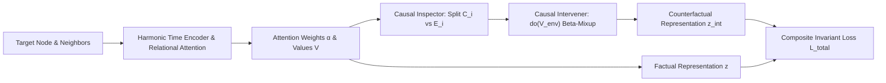

# CounterFraud-GNN: Counterfactual Temporal Graph Learning for Invariant Fraud Detection

[](https://www.python.org/downloads/)
[](https://pytorch.org/)
[](https://lightning.ai/)
[](https://github.com/astral-sh/ruff)
[]()
[](https://opensource.org/licenses/MIT)

## What this does

Every second, millions of digital payments flow through financial networks. Detecting fraudulent transactions in real time is crucial for stopping illicit activity and protecting cardholders.

Two major challenges make financial fraud detection on transaction networks exceptionally difficult:

1. **Fraud patterns constantly shift, creating misleading shortcuts.** Transaction volume surges during holidays, marketing promotions, or localized shopping sprees. Standard Graph Neural Networks (GNNs) easily latch onto these temporary environmental patterns, learning "shortcuts" that happen to correlate with fraud during one period but fail completely when real fraud tactics change.
2. **Extreme class imbalance and multi-relational connections.** Genuine fraud represents only a tiny fraction of total transactions (a needle in a massive haystack). Furthermore, transactions are not isolated events: they are interconnected across cardholders (`Source`), merchants (`Target`), physical stores (`Location`), and transaction channels (`Type`).

This project solves both problems with **CounterFraud-GNN (Counterfactual Temporal Graph Neural Network)**. By identifying the true invariant causal signals of fraud and actively stress-testing predictions against simulated environment shifts, the model produces robust fraud predictions that generalize across changing market conditions.

---

## How it works

CounterFraud-GNN models financial transactions as a dynamic, multi-relational graph and applies causal intervention techniques during training. A few key design choices make its predictions robust in practice rather than just accurate on historical training data:

- **It captures time continuously across all scales.** Fraudsters often execute rapid bursts of transactions within seconds, while seasonal habits evolve over months. Continuous Harmonic Time Encoding ($Time2Vec$) uses a bank of frequencies to capture both microsecond bursts and long-term cyclic trends without artificial time binning.
- **It reasons over multi-relational connections.** Multi-head relational attention dynamically weighs connections across shared cards, merchants, locations, and transaction types so the model attends to the most relevant historical context for each payment.
- **It separates causal signals from background noise.** A parameter-free Causal Inspector uses learned attention scores to partition a transaction's local neighborhood into invariant **Causal Nodes** ($\mathcal{C}_i$, the true behavioral drivers) and spurious **Environment Nodes** ($\mathcal{E}_i$, background noise like local sales surges).
- **It stress-tests predictions with counterfactual interventions.** To verify that predictions don't rely on spurious background noise, a Causal Intervener uses Beta-mixup backdoor adjustments ($do(V_{\text{env}})$) to swap out environmental features with donor representations. If the model is truly detecting invariant fraud mechanics, its verdict will remain consistent under these interventions.
- **Invariant consistency regularization prevents shortcut learning.** A composite objective with a progressive warmup schedule penalizes prediction volatility under environmental perturbations, steering the neural network away from fleeting shortcuts.
- **Decision thresholds are calibrated for extreme imbalance.** Rather than assuming a generic 0.5 decision boundary, the system dynamically searches for the optimal decision threshold on validation data to maximize Macro-F1 across severe class imbalances.
- **Validated rigorously across multiple random seeds.** Evaluated across 5 random seeds under strict chronological splits (70% train / 30% test) to guarantee reproducibility and statistical significance.

---

## Empirical benchmark performance

Evaluated on the **S-FFSD** financial fraud dataset across 5 random seeds (`42, 100, 2024, 777, 888`) under a strict chronological split (70% train / 30% test):

### Aggregate Results (Mean $\pm$ Std)

| Metric | CounterFraud-GNN Performance | Range [Min - Max] |
| :--- | :---: | :---: |
| **AUPRC** (Area Under PR Curve) | **$0.7094 \pm 0.1311$** | **0.5576 - 0.9155** |
| **AUROC** (Area Under ROC Curve) | **$0.8783 \pm 0.0484$** | **0.8193 - 0.9526** |
| **Macro-F1** (Calibrated Threshold) | **$0.7917 \pm 0.0471$** | **0.7509 - 0.8713** |
| **Calibrated Decision Threshold** | **$0.2820 \pm 0.0522$** | **0.2300 - 0.3600** |

### Per-Seed Detailed Breakdown

| Seed | AUPRC | AUROC | Macro-F1 | Calibrated Threshold |
| :---: | :---: | :---: | :---: | :---: |
| **42** | 0.7081 | 0.8732 | 0.7714 | 0.23 |
| **100** | 0.6530 | 0.8614 | 0.7700 | 0.30 |
| **2024** | 0.5576 | 0.8193 | 0.7509 | 0.28 |
| **777** | **0.9155** | **0.9526** | **0.8713** | 0.36 |
| **888** | 0.7126 | 0.8853 | 0.7951 | 0.24 |

---

## Mathematical formulations

<details>
<summary><b>Click to expand: metric derivations and model math</b></summary>

<br>



### 1. Continuous Harmonic Time Encoding ($Time2Vec$)

Given a continuous inter-event time delta $\Delta t_{ij} = |t_i - t_j|$, temporal encodings are projected via a bank of log-spaced frequencies:

$$\Phi(\Delta t) = \cos(\mathbf{w} \cdot \Delta t + \mathbf{b}), \quad \mathbf{w}_k = \frac{1}{10^{9 \cdot \frac{k}{d_{\mathrm{time}} - 1}}}$$

### 2. Multi-Head Relational Attention

Attention coefficients $e_{ij}^h$ combine Query, Key, Temporal embeddings, and discrete relation bias:

$$e_{ij}^h = \mathrm{LeakyReLU}\left(\mathbf{a}_h^T \left[ \mathbf{q}_i^h \mathbin{\Vert} \mathbf{k}_j^h \mathbin{\Vert} \Phi(\Delta t_{ij}) \right] \cdot \frac{1}{\sqrt{2 d_h + d_{\mathrm{time}}}}\right) + \mathbf{b}_{\mathrm{rel}}(r_{ij})^h$$

$$\alpha_{ij}^h = \frac{\exp(e_{ij}^h)}{\sum_{k \in \mathcal{N}_i} \exp(e_{ik}^h)}$$

### 3. Causal vs. Environment Neighborhood Partitioning

Neighborhood importance is scored by head-averaged attention weights $s_j = \frac{1}{H} \sum_{h=1}^H \alpha_{ij}^h$. The neighborhood is partitioned into environment slots $\mathcal{E}_i$ and causal slots $\mathcal{C}_i$ via threshold ratio $r_{\mathrm{env}}$:

$$\mathcal{E}_i = \mathrm{Bottom-}k_{\mathrm{env}}(s_j), \quad \mathcal{C}_i = \mathcal{N}_i \setminus \mathcal{E}_i, \quad \text{where } k_{\mathrm{env}} = \min(\lceil r_{\mathrm{env}} \cdot |\mathcal{N}_i| \rceil, |\mathcal{N}_i| - 1)$$

### 4. Counterfactual Beta-Mixup Backdoor Adjustment ($\mathrm{do}(V_{\mathrm{env}})$)

For each environment node $j \in \mathcal{E}_i$, its value representation $V_j$ is intervened by mixing with a top-$k$ causal donor $x_c \in \mathcal{C}_i$:

$$\mathrm{do}(V_j) = \lambda \cdot V_j + (1 - \lambda) \cdot x_c, \quad \lambda \sim \mathrm{Beta}(\alpha, \beta)$$

### 5. Composite Invariant Consistency Loss

The total objective enforces task accuracy while penalizing prediction shift under environmental interventions:

$$\mathcal{L}_{\mathrm{total}} = \mathcal{L}_{\mathrm{task}}(y, \hat{y}) + \gamma(t) \cdot \mathcal{L}_{\mathrm{task}}(y, \hat{y}_{\mathrm{int}}) + \eta \|\mathbf{w}\|_2^2$$

$$\text{with linear warmup: } \gamma(t) = \gamma_{\mathrm{max}} \cdot \min\left(1.0, \frac{t}{T_{\mathrm{warmup}}}\right)$$

### 6. Imbalanced Classification Losses

For class-imbalanced fraud detection, the base task loss $\mathcal{L}_{\mathrm{task}}$ supports Focal Loss and Weighted BCE:

$$\mathcal{L}_{\mathrm{focal}} = -\alpha_t (1 - p_t)^\gamma \log(p_t)$$

$$\mathcal{L}_{\mathrm{weighted\_bce}} = - \left[ w_{\mathrm{pos}} \cdot y \log(\sigma(\hat{y})) + (1 - y) \log(1 - \sigma(\hat{y})) \right]$$

### 7. Evaluation Metrics & Decision Calibration

- **AUPRC**: Area under the Precision-Recall curve, sensitive to rare positive (fraud) instances.
- **AUROC**: Area under the Receiver Operating Characteristic curve.
- **Macro-F1 & Threshold Tuning**: Finding optimal decision threshold $\tau^* = \arg\max_\tau \text{Macro-F1}(\tau)$ over validation predictions.

</details>

---

## Project structure

```text
CounterFraud-GNN/
├── counterfraud/                   # Core modular framework
│   ├── causal/
│   │   ├── inspector.py            # CausalInspector (attention-based slot partitioning)
│   │   ├── intervener.py           # CausalIntervener (Beta-mixup backdoor adjustment)
│   │   └── __init__.py
│   ├── layers/
│   │   ├── time.py                 # HarmonicTimeEncoder (Time2Vec continuous encoding)
│   │   ├── attention.py            # TemporalAttentionLayer (multi-head relational attention)
│   │   └── __init__.py
│   ├── losses/
│   │   ├── focal.py                # FocalLoss (class-imbalanced modulating factor)
│   │   ├── weighted_bce.py         # WeightedBCEWithLogitsLoss
│   │   ├── composite.py            # CompositeLoss (task + invariant consistency + L2)
│   │   └── __init__.py
│   ├── data/
│   │   ├── features.py             # 122-dim multi-window feature extractor
│   │   ├── dataset.py              # SFFSDGraphDataset (dense padded neighborhoods)
│   │   ├── datamodule.py           # FraudGraphDataModule (PyTorch Lightning)
│   │   └── __init__.py
│   ├── model.py                    # CaTGNN end-to-end neural network
│   ├── lit_module.py               # CaTGNNLightningModule (warmup, threshold search)
│   ├── metrics.py                  # AUROC, AUPRC, Macro-F1 metric utilities
│   └── __init__.py                 # Clean public API exports
├── main.py                         # Multi-seed CLI benchmark runner
├── train_multi_seeds.py            # Alias runner for multi-seed experiments
├── CaT_GNN_Walkthrough.ipynb       # Interactive portfolio notebook (code, math, plots)
├── tests/                          # Automated PyTest test suite
│   ├── test_counterfraud.py        # Unit tests for layers, shapes, and gradients
│   └── test_causal_verbatim.py     # Verification tests for causal interventions
├── multi_seed_results.csv          # Multi-seed benchmark results record
├── pyproject.toml                  # Dependency and tool configuration
├── uv.lock                         # Deterministic environment lockfile
├── .gitattributes                  # Linguist language configuration (*.ipynb -> Python)
└── .gitignore                      # Git artifact and cache exclusions
```

---

## Getting started

### 1. Installation

Set up the environment with `uv` (recommended) or `pip`:

```bash
# Clone the repository
git clone https://github.com/Chrisolande/CounterFraud-GNN.git
cd CounterFraud-GNN

# Create and sync virtual environment with uv
uv sync
```

Or using standard `pip`:

```bash
python -m venv .venv
source .venv/bin/activate  # On Windows: .venv\Scripts\activate
pip install -e .
```

### 2. Dataset setup

Place the S-FFSD dataset CSV file in the root directory:

```
CounterFraud-GNN/
├── S-FFSD.csv                        # Raw transaction dataset
└── sffsd_ai4risk_preprocessed.pt     # (Auto-generated on first run)
```

---

## Workflows & usage

### 1. Run the multi-seed benchmark CLI

Execute training and evaluation across 5 random seeds with automated metric aggregation (Mean $\pm$ Std):

```bash
python main.py \
    --seeds 42 100 2024 777 888 \
    --max_epochs 20 \
    --batch_size 128 \
    --base_loss focal \
    --gamma 1.0 \
    --warmup_epochs 3 \
    --export_csv multi_seed_results.csv
```

### 2. Programmatic Python API

Train and evaluate CounterFraud-GNN directly within Python scripts:

```python
import pytorch_lightning as pl
from counterfraud import FraudGraphDataModule, CaTGNNLightningModule

# 1. Prepare data module
dm = FraudGraphDataModule(data_path="S-FFSD.csv", batch_size=128, max_neighbors=20)
dm.setup()

# 2. Initialize Lightning module with causal consistency
model = CaTGNNLightningModule(
    cont_dim=dm.cont_dim,
    cat_dims=dm.cat_dims,
    hidden_dim=64,
    heads=4,
    gamma=1.0,
    warmup_epochs=3,
    base_loss="focal",
    pos_weight=dm.pos_weight,
)

# 3. Train and test
trainer = pl.Trainer(max_epochs=20, accelerator="auto")
trainer.fit(model, datamodule=dm)
trainer.test(model, datamodule=dm)
```

### 3. Feature engineering & graph construction

Extract 122-dimensional multi-window statistical features and relational graph structures:

```python
from counterfraud.data import build_features

# Extract features and relational adjacencies with automatic disk caching
data_dict = build_features(csv_path="S-FFSD.csv", cache_path="sffsd_ai4risk_preprocessed.pt")
print(f"Processed {data_dict['x_cont'].shape[0]} transactions with {data_dict['x_cont'].shape[1]} features.")
```

### 4. Interactive notebook & visualization

Explore model dynamics, step-by-step tensor transformations, and interactive transaction subgraphs:

```bash
# Launch interactive portfolio walkthrough
jupyter lab CaT_GNN_Walkthrough.ipynb

# Generate interactive PyVis transaction subgraph
python visualize_interactive_graph.py
```

---

## Key configurable parameters

| Argument | Type | Default | Description |
| :--- | :---: | :---: | :--- |
| `--seeds` | `list[int]` | `[42, 100, 2024, 777, 888]` | Seeds for multi-run benchmark aggregation. |
| `--max_epochs` | `int` | `20` | Maximum training epochs per seed. |
| `--batch_size` | `int` | `128` | Mini-batch size for DataLoader. |
| `--base_loss` | `str` | `focal` | Base task loss (`focal` or `weighted_bce`). |
| `--gamma` | `float` | `1.0` | Peak weight on causal-invariant consistency loss $\gamma$. |
| `--warmup_epochs` | `int` | `3` | Epochs to linearly ramp $\gamma$ from $0 \to \gamma_{\text{max}}$. |
| `--env_ratio` | `float` | `0.2` | Fraction of lowest-attention neighbors assigned to $\mathcal{E}_i$. |
| `--top_k` | `int` | `5` | Candidate causal donor pool size for Beta-mixup. |
| `--time_dim` | `int` | `16` | Frequency dimension for Harmonic Time2Vec. |
| `--hidden_dim` | `int` | `64` | GNN hidden representation dimension. |
| `--heads` | `int` | `4` | Number of relational attention heads. |
| `--export_csv` | `str` | `multi_seed_results.csv` | Output file for benchmark metrics summary. |

---

## Testing & quality assurance

```bash
# Run test suite (7 tests)
uv run pytest tests/ -v

# Run code style & lint checks
uv run ruff check counterfraud tests
```

---

## License

Distributed under the MIT License. See `LICENSE` for details.
